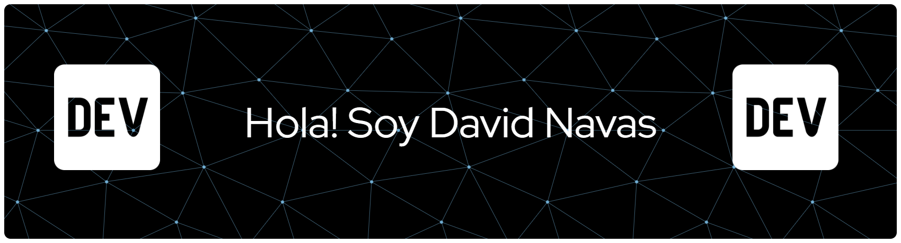

<div align="center">



</div>

<div align="center">

[](https://git.io/typing-svg)

</div>

## Who am I?

 ```python
  class WhoAmI:
    user = 'David Nava'
	current_edu = "Campuslands"
    currently_learning = "Git and Scrum soon"
    fun_fact = "I hate barcelona"
	hobbies = [
				'Music',
            'Chilling',
			 	'Gaming',
				'Sports'
			]	
 ```
## Learned skills


## Skills to learn
<p>
    <a href="#"></a>
    <a href="#"></a>
    <a href="#"></a>
</p>

## About me

[.+Siempre+aprendiendo+y+creciendo.;💻+Me+apasiona+la+programacion+y+descubrir+algo+nuevo+cada+dia.;🤖+Interesado+en+IA+y+su+futuro+en+la+automatizacion.;🗣️+Idiomas%3A+Español+(nativo)+·+Inglés+(intermedio))](https://git.io/typing-svg)

------
[David Navas](https://github.com/DavidNavas898)

Last Edited on - 13/04/2026